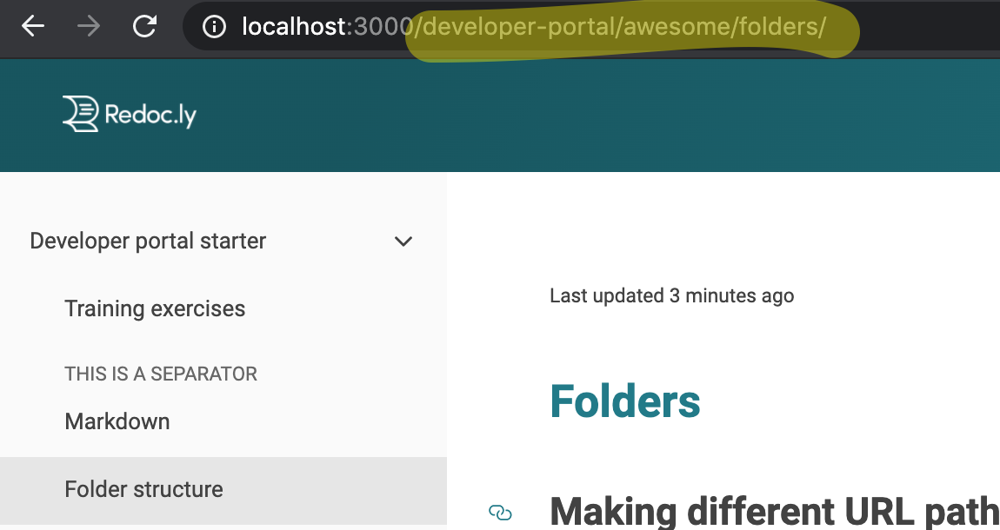
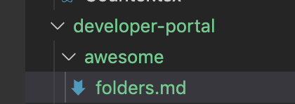

# Folder structure training

## Changing URL paths

The filename is used in the URL path and so is the folder.
Nested folders will result in deep paths.

If you look at the path for this page, you'll see it is at `/developer-portal/awesome/folders`.



The title of the page is `Folder structure training` and doesn't match the path.



The path is generated from the folder structure path and filename less the filename extension (`.md` in this case).
If the file is named `index.md` or `index.mdx` the filename does not appear in the URL path.

If we renamed `folders.md` to `index.md` and left it in the same folder, what would the URL be?

- `http://localhost:3000/developer-portal/awesome/`

Let's try it out...

### Rename to index

Rename the `folders.md` file to `index.md`.

You will also need to change references to that file, which exist in the `sidebars.yaml` file located in the root directory.

```yaml Original
- label: Folder structure
  page: developer-portal/awesome/folders.md
```

```yaml New
- label: Folder structure
  page: developer-portal/awesome/index.md
```

Great? Now, revert the name back to `folders.md` and revert the change in the `sidebars.yaml` file.

### Move the file to a different folder

Move this `folders.md` to the root directory.
The root directory means it will site side-by-side with other files and folders such as `siteConfig.yaml` and `sidebars.yaml`.

This file is referenced in `sidebars.yaml`.
Adjust the relative path to the file from there again.

```yaml Original
- label: Folder structure
  page: developer-portal/awesome/folders.md
```

```yaml New
- label: Folder structure
  page: folders.md
```

Adjust the relative path to the images within the actual file too.

If the image is broken (does not load), it indicates the path to the image is incorrect.

The current directory means the directory where the markdown file is located.
The `./` start means starting from the current directory.
The `../` moves up to the parent directory.
And `../../` moves up two levels.
And so on.

## Troubleshooting

Files, folders, and navigation paths may be cached.
If your page isn't loading check if you have the correct path in the browser.
If it still isn't loading, stop the server, run `yarn clean`, and then `yarn start` again.
