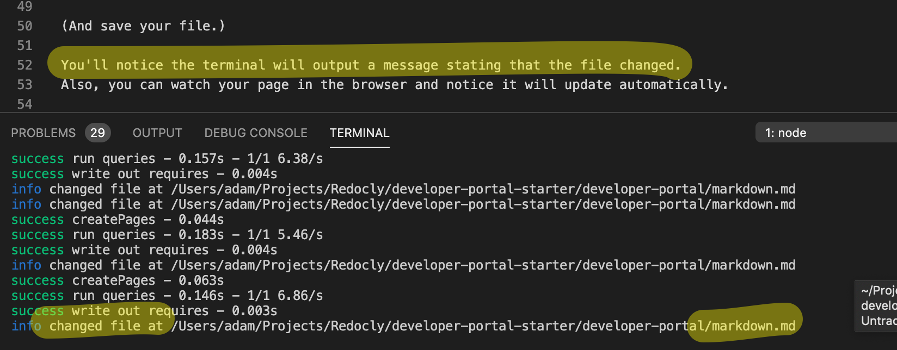

# GitHub-flavored markdown example

These exercises assume you have [basic markdown knowledge](https://docs.redoc.ly/developer-portal/markdown/).

## Create a new plain markdown page

In the `developer-portal` folder, create a new file named `plain.md`.

Copy/paste this content into the file (or write some of your own). And save the file.

```markdown
# H1

Body text.

## H2

Body text.

### H3

Body text.

Notice the URL in the address bar is localhost:3000/developer-portal/plain.
The file name maps to the URL path.

[take me back to the markdown training exercise](markdown.md)
```

So now you've create a page, but how do you access it?

### Accessing your new content

#### Link to it from other pages

You can create a link to it.

To do that, you can edit this `markdown.md` file and remove the back ticks around this example.

```markdown
[My first plain markdown page!](plain.md)
```

(And save your file.)

You'll notice the terminal will output a message stating that the file changed.
Also, you can watch your page in the browser and notice it will update automatically.



Then you can click on your link.

#### Link to it from navigation

You can also link to your page from various navigation elements:

- top navigation
- footer navigation
- sidebar navigation

If you link to it from sidebar navigation, the sidebar will display on the page.

Linking to it from navigation is the subject of other training exercises.

## Add an image to your markdown page

You can copy/paste this into your page.

```markdown

```

Or, you can add an image.
You can add an image anywhere in the directory structure.
We created this directory path `developer-portal/images/` to store the training exercise images.
It's important to note that the relative path to the image file is from the markdown file you are referencing it from.

If the image looks blurry it is related to the development server.
Refresh your browser page and the image should load.
If the image is broken (does not load), it indicates the path to the image is incorrect.
The `./` start means starting from the current directory.
The `../` moves up to the parent directory.
And `../../` moves up two levels.
And so on.

Training exercise accomplished?

## Let's add a video too

Find a video online and copy the "embed" code (or use this below).

```html
<iframe
  width="560"
  height="315"
  src="https://www.youtube.com/embed/NcEHOlnAY6A"
  frameborder="0"
  allow="accelerometer; autoplay; encrypted-media; gyroscope; picture-in-picture"
  allowfullscreen
></iframe>
```

Then paste it in the markdown and voila!

<iframe width="560" height="315" src="https://www.youtube.com/embed/NcEHOlnAY6A" frameborder="0" allow="accelerometer; autoplay; encrypted-media; gyroscope; picture-in-picture" allowfullscreen></iframe>

## Content reuse

You can reuse content using the [embed tag](https://redoc.ly/docs/developer-portal/guides/reusing-content/).

## Admonitions

:::warning
Use various [admonitions](https://redoc.ly/docs/developer-portal/markdown/#admonitions) like this warning.
:::

:::info INFO
info
:::

:::success Yee-haw!
success
:::

:::danger
danger
:::

:::attention
attention
:::

## Review

You made a new file.
It ended with the `.md` file extension.
The name could be seen in the URL path in the browser bar (the full path includes any folders it is in).
You included images and videos on your page.
