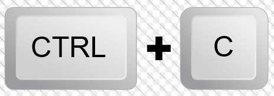

# Install the developer portal

## Clone

```bash
git clone git@github.com:Redocly/developer-portal-starter.git

cd developer-portal-starter
```

## Install dependencies

Before you start... you'll need node and yarn installed.

- [node.js >= 12](https://nodejs.org/en/)
- [yarn](https://yarnpkg.com/en/)

```bash
yarn install
```

:::attention
Depending on your operating system, you may see warnings when installing dependencies.
:::

## Start the development environment

```bash
yarn start
```

This command will start a development server.
Most functionality exists in the development server except for search.
When the server is ready, the url will be published to the console.
It may default to http://localhost:3000.
Open that in a browser to see this developer portal load.

## Stop the development environment

Press control and c.



## Clearing cache

:::warning
Troubleshooting? Try this out.
:::

A few changes (such as changing the key of a sidebar definition) require clearing cache to reflect in the local server.
We actively reduce these to make the best development environment experience possible.

1. Press control-c.
1. Run `yarn clean` in the command prompt to clear the cache.
1. Run `yarn start` again.

## Next steps

You are ready to train!

Go to the [training exercises list](index.md).
