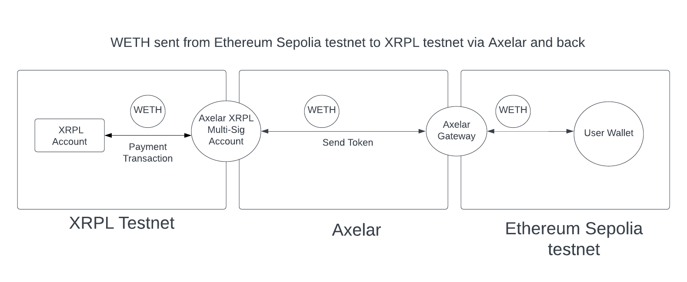
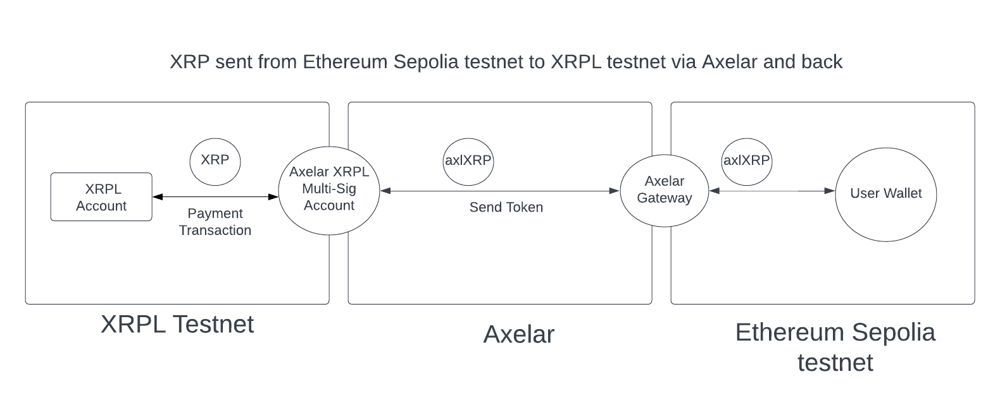

# Bridge Tokens Between Ethereum and XRPL

<embed src="/snippets/_axelar-disclaimer.md" />

This tutorial describes how to transfer tokens between Ethereum `Sepolia` and the XRPL `Testnet`.


## Prerequisites

- [Foundry](https://book.getfoundry.sh/getting-started/installation)
- [XRPL.js Library](https://js.xrpl.org/)
- An RPC provider, such as Alchemy or Infura, with the `SEPOLIA_RPC_URL` environment variable set to a working `Sepolia` RPC URL.
- Funded wallets on both chains.
  - **ETH Sepolia Faucet:** [alchemy.com/faucets/ethereum-sepolia](https://www.alchemy.com/faucets/ethereum-sepolia)
  - **XRPL Testnet Faucet:** [faucet.tequ.dev](https://faucet.tequ.dev/)


## Bridge ETH



### ETH from Ethereum to XRPL

1. Create a trust line on XRPL `testnet` between the Axelar multisig account and the destination account, using the `TrustSet` transaction.

    ```javascript
    {
        "TransactionType": "TrustSet",
        "Account": user.address, // the XRPL address of the ETH transfer recipient
        "LimitAmount": {
            "currency": "ETH",
            "issuer": "rfEf91bLxrTVC76vw1W3Ur8Jk4Lwujskmb",
            "value": "10000000000",
        },
        ...
    },
    ```

2. Wrap ETH on Ethereum `Sepolia`. You can do this using the Foundry `cast` command, or directly on Etherscan.

    - Using Foundry's `cast` command:

    ```sh
    WETH=0x7b79995e5f793a07bc00c21412e50ecae098e7f9
    cast send $WETH "deposit()" --value 0.1ether --private-key $PRIVATE_KEY --rpc-url $SEPOLIA_RPC_URL
    ```

    - Using [Etherescan](https://sepolia.etherscan.io/token/0x7b79995e5f793a07bc00c21412e50ecae098e7f9#writeContract), select **Connect to Web3** to connect your wallet. Expand the **deposit** dropdown and type the amount of ETH you want to bridge. Click **Write** to perform the transaction.

3. Approve the `AxelarGateway` contract to spend your WETH on Ethereum `Sepolia`:

    - Using Foundry's `cast` command:

    ```sh
    WETH=0x7b79995e5f793a07bc00c21412e50ecae098e7f9
    AXELAR_GATEWAY=0xAABdd46ba1B3147d0Cf6aCc9605a74fE8668fC74
    cast send $WETH "approve(address guy, uint256 amount)" $AXELAR_GATEWAY $(cast to-wei 0.1) --private-key $PRIVATE_KEY --rpc-url $SEPOLIA_RPC_URL
    ```

    - Using [Etherescan](https://sepolia.etherscan.io/token/0x7b79995e5f793a07bc00c21412e50ecae098e7f9#writeContract), select **Connect to Web3** to connect your wallet. Expand the **approve** dropdown, enter `AxelarGateway`'s address (`0x832B2dfe8a225550C144626111660f61B8690efD`), and the amount of ETH to bridge under **deposit**. Click **Write** to perform the transcation.

4. On Ethereum Sepolia, call `AxelarGateway.sendToken()` to bridge your WETH.

    ```sh
    AXELAR_GATEWAY=0xAABdd46ba1B3147d0Cf6aCc9605a74fE8668fC74
    XRPL_DESTINATION= # your XRPL recipient address
    cast send $AXELAR_GATEWAY "sendToken(string destinationChain, string destinationAddress, string symbol, uint256 amount)" "xrpl" $XRPL_DESTINATION "WETH" $(cast to-wei 0.1) --private-key $PRIVATE_KEY --rpc-url $SEPOLIA_RPC_URL
    ```

5. The destination address should receive the bridged ETH in a few minutes. You can check for a successful transaction on the [XRPL Testnet explorer](https://testnet.xrpl.org/).


### Wrapped ETH from XRPL to Ethereum

1. Deposit ETH into the XRPL multisig account, using a `Payment` transaction.

    ```javascript
    {
        TransactionType: "Payment",
        Account: user.address, // The user initiating the transfer
        Amount: {
            currency: "ETH",
            value: "0.001", // = 10^15 wei - the amount of ETH you want to bridge, in ETH
            issuer: "rfEf91bLxrTVC76vw1W3Ur8Jk4Lwujskmb",
        },
        Destination: "rfEf91bLxrTVC76vw1W3Ur8Jk4Lwujskmb", // Axelar's XRPL multisig account
        Memos: [
            {
                Memo: {
                    MemoData: "605459C28E6bE7B31B8b622FD29C82B3059dB1C6", // your ETH recipient address, without the 0x prefix
                    MemoType: "64657374696E6174696F6E5F61646472657373", // hex("destination_address")
                },
            },
            {
                Memo: {
                    MemoData: "657468657265756D", // hex("ethereum")
                    MemoType: "64657374696E6174696F6E5F636861696E", // hex("destination_chain")
                },
            },
            {
                Memo: {
                    MemoData: "0000000000000000000000000000000000000000000000000000000000000000", // bytes32(0) indicates pure token transfer, without GMP
                    MemoType: "7061796C6F61645F68617368", // hex("payload_hash")
                },
            },
        ],
        ...
    }
    ```

2. Within a few minutes, the `destination_address` should receive the bridged ETH on Ethereum `Sepolia`, as WETH. You can check for the transaction on the [Ethereum Sepolia explorer](https://sepolia.etherscan.io/).


## Bridge XRP



### XRP from XRPL to Ethereum

1. Deposit XRP into the XRPL multisig account, using a `Payment` transaction.

    ```javascript
    {
        TransactionType: "Payment",
        Account: user.address, // The user initiating the transfer
        Amount: "1000000", // = 1 XRP - the amount of XRP you want to bridge, in drops
        Destination: "rfEf91bLxrTVC76vw1W3Ur8Jk4Lwujskmb", // Axelar's XRPL multisig account
        Memos: [
            {
                Memo: {
                    MemoData: "605459C28E6bE7B31B8b622FD29C82B3059dB1C6", // your ETH recipient address, without the 0x prefix
                    MemoType: "64657374696E6174696F6E5F61646472657373", // hex("destination_address")
                },
            },
            {
                Memo: {
                    MemoData: "657468657265756D", // hex("ethereum")
                    MemoType: "64657374696E6174696F6E5F636861696E", // hex("destination_chain")
                },
            },
            {
                Memo: {
                    MemoData: "0000000000000000000000000000000000000000000000000000000000000000", // bytes32(0) indicates pure token transfer, without GMP
                    MemoType: "7061796C6F61645F68617368", // hex("payload_hash")
                },
            },
        ],
        ...
    }
    ```

2. Within a few minutes, the `destination_address` should receive the bridged XRP on Ethereum Sepolia, as Axelar-wrapped XRP (axlXRP). You can check for the transaction on the [Ethereum Sepolia explorer](https://sepolia.etherscan.io/).


### Wrapped XRP (axlXRP) from Ethereum to XRPL

1. Approve the `AxelarGateway` contract to spend your axlXRP on Ethereum `Sepolia`:

    - Using Foundry's `cast` command:

    ```sh
    AXL_XRP=0x40d5ed73982468499ecfa9c8cc0abb63ff13a409
    AXELAR_GATEWAY=0xAABdd46ba1B3147d0Cf6aCc9605a74fE8668fC74
    cast send $AXL_XRP "approve(address guy, uint256 amount)" $AXELAR_GATEWAY 1000000 --private-key $PRIVATE_KEY --rpc-url $SEPOLIA_RPC_URL
    ```

    - Using [Etherescan](https://sepolia.etherscan.io/token/0x40d5ed73982468499ecfa9c8cc0abb63ff13a409#writeContract), select **Connect to Web3** to connect your wallet. Expand the **approve** dropdown, enter the `AxelarGateway`'s address (`0x832B2dfe8a225550C144626111660f61B8690efD`) and the amount of axlXRP to bridge under **deposit**. Click **Write** to perform the transcation.

2. On Ethereum `Sepolia`, call `AxelarGateway.sendToken()` to bridge your axlXRP.

    ```sh
    AXELAR_GATEWAY=0xAABdd46ba1B3147d0Cf6aCc9605a74fE8668fC74
    XRPL_DESTINATION= # your XRPL recipient address
    cast send $AXELAR_GATEWAY "sendToken(string destinationChain, string destinationAddress, string symbol, uint256 amount)" "xrpl" $XRPL_DESTINATION "axlXRP" 1000000 --private-key $PRIVATE_KEY --rpc-url $SEPOLIA_RPC_URL
    ```

3. Within a few minutes, your destination address should receive the XRP. You can check for the transaction on the [XRPL Testnet explorer](https://testnet.xrpl.org/).
