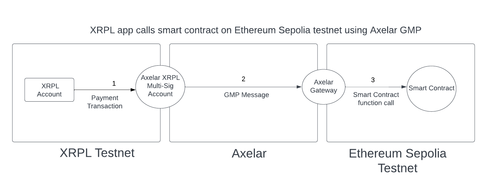

# Call a Smart Contract Function

<embed src="/snippets/_axelar-disclaimer.md" />

This tutorial describes how to call a function from a smart contract on Ethereum `Sepolia` from the XRPL `Testnet`, using General Message Passing (GMP). The following diagram illustrates the process from a high level:




## Prerequisites

- [Foundry](https://book.getfoundry.sh/getting-started/installation)
- An RPC provider, such as Alchemy or Infura, with the `SEPOLIA_RPC_URL` environment variable set to a working `Sepolia` RPC URL.
- Funded wallets on both chains.
  - **ETH Sepolia Faucet:** [alchemy.com/faucets/ethereum-sepolia](https://www.alchemy.com/faucets/ethereum-sepolia)
  - **XRPL Testnet Faucet:** [faucet.tequ.dev](https://faucet.tequ.dev/)
- [XRPL JS Library](https://js.xrpl.org/)
- To perform GMP from XRPL to Ethereum, the Ethereum smart contract that you wish to call needs to implement the [`AxelarExecutable`](https://github.com/commonprefix/axelar-xrpl-solidity/blob/main/src/executable/AxelarExecutable.sol) contract. Please keep in mind that this contract is not the standard `AxelarExecutable` contract you would find on other Axelar resources.


## Steps

1. Compute the payload (let's call it `gmpPayload`) that you would like to call your Ethereum Sepolia `AxelarExecutable` smart contract's `_execute` function with.

2. Submit a `Payment` transaction on XRPL.
    - If you just want to GMP without transferring tokens, set the `Amount` to `1` drop of XRP.
    - Set the destination address in the `MemoData` field to the address of the Ethereum Sepolia `AxelarExecutable` smart contract.
    - Set the payload hash in the `MemoData` field to `keccak256(abi.encode(gmpPayload))`. You can use the [`eth-abi`](https://eth-abi.readthedocs.io/en/stable/encoding.html) and [`eth-utils`](https://eth-utils.readthedocs.io/en/stable/utilities.html#keccak-bytes-int-bool-text-str-hexstr-str-bytes) python libraries to compute this hash:

    ```py
    from eth_abi import encode
    from eth_utils import keccak
    keccak(encode(['string'], ['hello, world!'])).hex()
    ```

3. Within a few minutes, the relayer should submit validator signatures of the XRPL Testnet deposit transaction to the Ethereum Sepolia `AxelarGateway` contract, which records the approval of the payload hash and emits a `ContractCallApproved` event. You can verify that this event was called using the [Ethereum Sepolia explorer](https://sepolia.etherscan.io/address/0xAABdd46ba1B3147d0Cf6aCc9605a74fE8668fC74).

4. Call the `execute` function on your `AxelarExecutable` Ethereum Sepolia smart contract.

    ```sh
    AXELAR_EXECUTABLE= # your `AxelarExecutable` contract
    COMMAND_ID= # the `commandId` that was emitted in the `ContractCallApproved` event
    SOURCE_ADDRESS= # the XRPL address that performed the `Payment` deposit transaction
    PAYLOAD= # abi.encode(['string', 'uint256', 'bytes'], [symbol, amount, gmpPayload])
    cast send $AXELAR_EXECUTABLE 'function execute(bytes32 commandId, string calldata sourceChain, string calldata sourceAddress, bytes calldata payload)' $COMMAND_ID xrpl $SOURCE_ADDRESS $PAYLOAD --private-key $PRIVATE_KEY --rpc-url $SEPOLIA_RPC_URL
    ```


## Example GMP Call

We have created and [deployed to Ethereum Sepolia](https://sepolia.etherscan.io/address/0x189C2572063f25FEf5Cdd3516DDDd9fA6e9CB187) an example `AxelarExecutable` contract called [`ExecutableSample`](https://github.com/commonprefix/axelar-xrpl-solidity/blob/main/src/executable/examples/ExecutableSample.sol).

This example calls the `ExecutableSample` contract from XRPL to update its `message` state variable to `Just transferred XRP to Ethereum!`.

1. Initiate the GMP call by submitting a `Payment` transaction to the XRPL multisig.

    ```javascript
    import * as xrpl from "xrpl";

    const XRPL_RPC_URL = "wss://s.altnet.rippletest.net:51233";
    async function gmp() {
        const client = new xrpl.Client(XRPL_RPC_URL);
        await client.connect();

        // const user = xrpl.Wallet.fromSeed(SEED); // Read XRPL wallet seed from environment or generate and fund new wallet:
        const user = xrpl.Wallet.generate();
        await client.fundWallet(user);

        const paymentTx: xrpl.Transaction = {
            TransactionType: "Payment",
            Account: user.address,
            Amount: "1",
            Destination: "rfEf91bLxrTVC76vw1W3Ur8Jk4Lwujskmb",
            SigningPubKey: "",
            Flags: 0,
            Fee: "30",
            Memos: [
                {
                    Memo: {
                        MemoData: "189C2572063f25FEf5Cdd3516DDDd9fA6e9CB187", // the `ExecutableSample` contract
                        MemoType: Buffer.from("destination_address").toString('hex').toUpperCase(),
                    },
                },
                {
                    Memo: {
                        MemoData: Buffer.from("ethereum").toString('hex').toUpperCase(),
                        MemoType: Buffer.from("destination_chain").toString('hex').toUpperCase(),
                    },
                },
                {
                    Memo: {
                        MemoData: "df031b281246235d0e8c8254cd731ed95d2caf4db4da67f41a71567664a1fae8", // keccak256(abi.encode(gmpPayload))
                        MemoType: Buffer.from("payload_hash").toString('hex').toUpperCase(),
                    },
                },
            ],
        };

        const signed = user.sign(await client.autofill(paymentTx));
        console.log(signed);
        await client.submitAndWait(signed.tx_blob);
        await client.disconnect();
    }

    gmp();
    ```

2. Wait for the relayer to call `AxelarGateway.execute()`. Verify that the `ContractCallApproved` event was called using the [Ethereum Sepolia explorer](https://sepolia.etherscan.io/address/0xAABdd46ba1B3147d0Cf6aCc9605a74fE8668fC74).

3. Call the `ExecutableSample.execute()`.

    ```sh
    AXELAR_EXECUTABLE=0x189C2572063f25FEf5Cdd3516DDDd9fA6e9CB187
    COMMAND_ID= # the `commandId` that was emitted in the `ContractCallApproved` event
    SOURCE_ADDRESS= # the XRPL address of the `user` who performed the `Payment` deposit transaction
    PAYLOAD=000000000000000000000000000000000000000000000000000000000000006000000000000000000000000000000000000000000000000000000000000f424000000000000000000000000000000000000000000000000000000000000000a0000000000000000000000000000000000000000000000000000000000000000661786c58525000000000000000000000000000000000000000000000000000000000000000000000000000000000000000000000000000000000000000000080000000000000000000000000000000000000000000000000000000000000002000000000000000000000000000000000000000000000000000000000000000214a757374207472616e736665727265642058525020746f20457468657265756d2100000000000000000000000000000000000000000000000000000000000000 # encode(['string', 'uint256', 'bytes'], [symbol, amount, encode(['string'], ['Just transferred XRP to Ethereum!'])])
    cast send $AXELAR_EXECUTABLE 'function execute(bytes32 commandId, string calldata sourceChain, string calldata sourceAddress, bytes calldata payload)' $COMMAND_ID xrpl $SOURCE_ADDRESS $PAYLOAD --private-key $PRIVATE_KEY --rpc-url $SEPOLIA_RPC_URL
    ```

4. `AxelarExecutable.message` should now be set to `'Just transferred XRP to Ethereum!'`.

    ```sh
    AXELAR_EXECUTABLE=0x189C2572063f25FEf5Cdd3516DDDd9fA6e9CB187
    cast call $AXELAR_EXECUTABLE 'message()(string)' --rpc-url $SEPOLIA_RPC_URL
    # Just transferred XRP to Ethereum!
    ```
