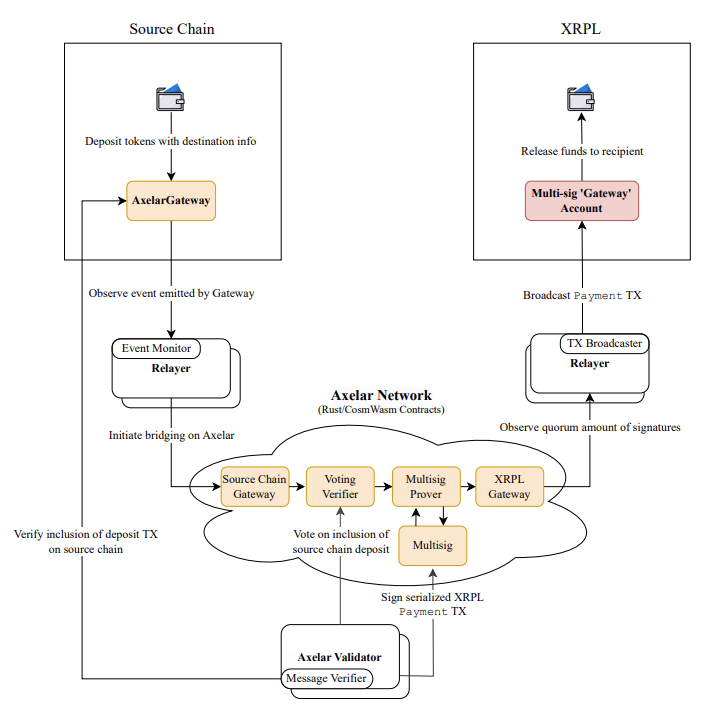
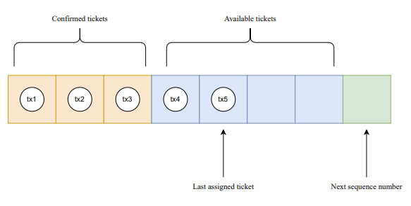
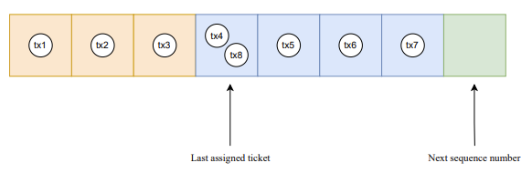
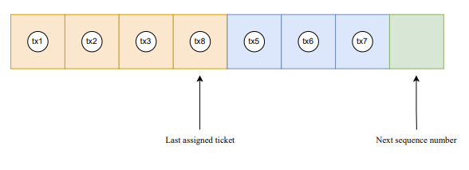

# Axelar Network

The [Axelar network](https://www.axelar.network/) is a Web3 interoperability platform, acting as a bridge between blockchains. The XRPL-Axelar integration enables the transfer of XRP and XRPL-issued tokens to other chains, and the transfer of tokens from other chains (such as ERC-20 tokens) to the XRPL. The integration additionally enables performing [general message passing (GMP) calls](https://www.axelar.network/blog/general-message-passing-and-how-can-it-change-web3) *from* the XRPL, i.e., calling smart contracts that live on Axelar-supported chains from XRPL.

At a high level, the bridging process is fairly simple.

For outbound transactions _from_ the XRPL:

| Token Origin | Steps |
|--------------|-------|
| Native XRPL-issued tokens. | 1. XRPL locks assets. 2. Axelar confirms assets are locked on the XRPL. 3. Axelar issues wrapped assets on another chain. |
| Non-native tokens. | 1. XRPL burns wrapped assets. 2. Axelar confirms assets are burned. 3. Axelar releases the locked assets on the other chain. |

For inbound transactions _to_ the XRPL:

| Token Origin | Steps |
|--------------|-------|
| Native XRPL-issued tokens. | 1. Other chain burns the XRPL-issued tokens. 2. Axelar confirms assets are burned on the other chain. 3. Axelar releases locked assets on the XRPL. |
| Non-native tokens. | 1. Other chain locks its native tokens. 2. Axelar confirms assets are locked. 3. Axelar issues wrapped assets on the XRPL. |

To help facilitate bridging throughput, the Axelar network utilizes the [ticketing feature](https://xrpl.org/docs/references/protocol/ledger-data/ledger-entry-types/ticket/) on XRPL to enable multiple in-flight transactions.

## Security

The XRPL-Axelar integration is secured by a multisig XRPL account owned by Axelar validators. The top 32 validators, ranked by the amount of AXL they stake on the Axelar PoS network, act as signers for the Axelar multisig account. The validators must agree on transaction data before sending sending a transaction across chains.

You can learn more about the security of the Axelar network [here](https://www.axelar.network/blog/security-at-axelar-core).

## Components

### On-chain:

The [XRPL multi-signing account](https://xrpl.org/docs/tutorials/how-tos/manage-account-settings/set-up-multi-signing) handles bridging on the XRPL side by releasing/issuing assets, or locking/burning assets. On EVM and Cosmos chains, the equivalent is a Gateway smart contract.

The Axelar network is enabled by four smart contracts:

- **Gateway:** A smart contract that handles incoming and outgoing messages for a particular chain.
- **Voting Verifier:** A smart contract that verifies the authenticity and status of transactions on the XRPL multisig account by counting votes submitted by Axelar validators.
- **Multisig Prover:** Constructs and serializes XRPL multisig transactions to be transmitted to XRPL. Calls the “Multisig” contract on Axelar to initiate a signing session.
- **Multisig:** Handles collection of signatures and keeps record of the weight of each signer.

### Off-chain:

- **Relayer:** A permissionless off-chain process that informs the Axelar network of new transactions from a source chain. The relayer also submits transactions prepared by the Amplifier network to a destination chain. The relayer consists of these sub-components:
    - **Event Monitor:** Monitors events on the XRPL.
    - **TX Broadcaster:** Submits serialized and signed transactions to XRPL.
    - **Axelar Validator:** Votes if transactions have been included on chain and signs new transactions.
    - **Message Verifier:** Verifies the inclusion of a transaction on the XRPL multisig account, and the status of that transaction.

## Cross-chain Flows

### Payments from XRPL to another blockchain

1. XRPL users send a `Payment` transaction to the Axelar multisig account. In the `Memos` field, the user includes the destination chain and destination address.
2. The relayer notifies the Axelar network that tokens were transferred to the XRPL multisig.
3. Axelar validators vote to confirm that the transaction was successful on the XRPL.
4. The transaction is encoded and signed for the destination chain.
5. The relayer submits the signed transaction to the destination chain.
6. The destination chain mints/releases assets on the destination chain to the destination address.

### Payments from another source chain to XRPL

1. User transfers tokens to source chain’s Axelar Gateway smart contract, including the XRPL as the destination chain and the XRPL destination account in the contract call.
2. The relayer submits the transaction to the Axelar network.
3. Axelar validators vote that the transaction is finalized on the source chain.
4. The transaction is assigned an XRPL multisig ticket number, enabling multiple in-flight transactions. See: [Ticket Assignment Logic](#ticketing-logic).
5. The transaction is serialized in the native XRPL binary format.
6. Axelar validators sign the serialized transaction.
7. The relayer submits the signed and serialized transaction to XRPL.
8. The Multisig account issues/releases tokens to the destination address.

## TicketCreate Flow

Tickets are used to enable multiple in-flight transactions and improve throughput. The XRPL limits the number of available tickets at any given time to 250. When the amount of tickets available matches a configurable threshold, a new `TicketCreate` transaction must be submitted.

1. A `Payment` transaction is confirmed to be included in the XRPL by Axelar validators, making the number of available tickets less than the ticket creation threshold.
2. A relayer requests a `TicketCreate` transaction from the Axelar network.
3. `TicketCreate` is created and serialized with an amount of: 250 - len(available_tickets).
    **Note:** There may actually be less available tickets to use in XRPL than the smart contract is aware of until pending transactions are confirmed, but there can't be more.
4. Axelar validators sign the new `TicketCreate` transaction.
5. The relayer submits the transaction to the XRPL.
6. When the transaction is included in the ledger, the relayer asks for the transaction to be confirmed on Axelar.
7. Axelar validators vote on whether the XRPL transaction has been finalized.
8. If the poll ends successfully, the created tickets are available to be assigned to new `Payment` transactions.

### Ticketing Logic

A set of XRPL multisig tickets are always available: these tickets have been created with `TicketCreate`, but are not confirmed to have been consumed by transactions on the XRPL. If the number of available tickets falls below a configurable threshold, a new `TicketCreate` transaction is constructed and broadcasted. New transactions are assigned available tickets until they are all exhausted.

At this point, ticket assignment will wrap around to the first available tickets (similar to “round robin” load-balancing algorithms), leading to multiple tickets being assigned to the same transaction.

Only one of the transactions with the same ticket number will ultimately be included in the ledger, in which case the ticket is assigned to that transaction forever.

## SignerListSet Flow

The list of signers and their weights must match the Axelar validators and their stake. Periodically, or when weights change significantly, the XRPL multisig’s signer list must be updated to match the Axelar validator's latest stake. Updating the XRPL multisig signer list goes as follows:

1. The set of Axelar validators or their stake changes.
2. A relayer requests a `SignerListSet` transaction from the Axelar network.
3. An XRPL `SignerListSet` transaction is constructed and serialized.
4. Axelar validators sign the `SignerListSet` transaction.
5. The relayer submits the transaction on the XRPL.
6. When it is included in the ledger, the relayer asks for the `SignerListSet` transaction to be confirmed on Axelar.
7. Axelar validators vote on whether the `SignerListSet` transaction has been included in the XRPL.
8. If verified by validators, the new signer list is used to sign future transactions. Until this step is reached, the previous signer list signs pending transactions.
