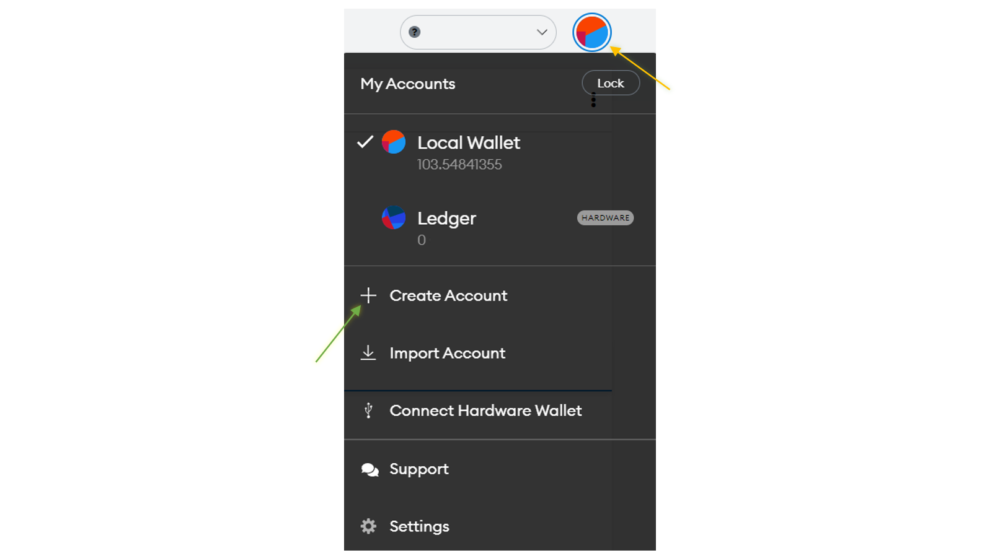
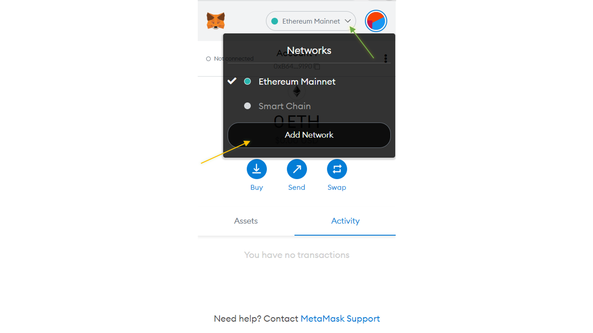

# Connect MetaMask to the XRPL EVM Sidechain

<embed src="/snippets/_evm-sidechain-disclaimer.md" />

MetaMask is an extension for accessing Harmony-enabled distributed applications (_dapps_) from your browser. The extension injects the XRP Ledger EVM sidechain Web3 API into every website's Javascript context, so that Web3 applications can read from the blockchain. <!-- SPELLING_IGNORE: dapps -->

This tutorial walks through the process of installing MetaMask, configuring it on the XRP Ledger EVM sidechain network, and importing an existing account using a previously generated private key.

## 1. Installing MetaMask

Install the MetaMask extension on your browser from **[https://metamask.io/download/](https://metamask.io/download/)**. The extension supports most desktop browsers. 

## 2. Create an Account on MetaMask

To create a new account on MetaMask:

1. Click the MetaMask icon.

    

2. Choose **Create Account**.

3. Enter the Account Name.

4. Click **Create**.

### 3. Adding XRP Ledger EVM Sidechain to MetaMask

To add XRP Ledger EVM Sidechain to MetaMask:

1. Open the MetaMask extension.

2. Use the drop-down menu to choose **Add Network**.
    

3. Enter the XRP Ledger Devnet endpoint information.

    * **Network Name**: XRPL EVM Sidechain Devnet
    * **New RPC URL**: https://rpc-evm-sidechain.xrpl.org
    * **Chain ID**: 1440002
    * **Currency Symbol**: XRP
    * **Block Explorer**: https://evm-sidechain.xrpl.org
