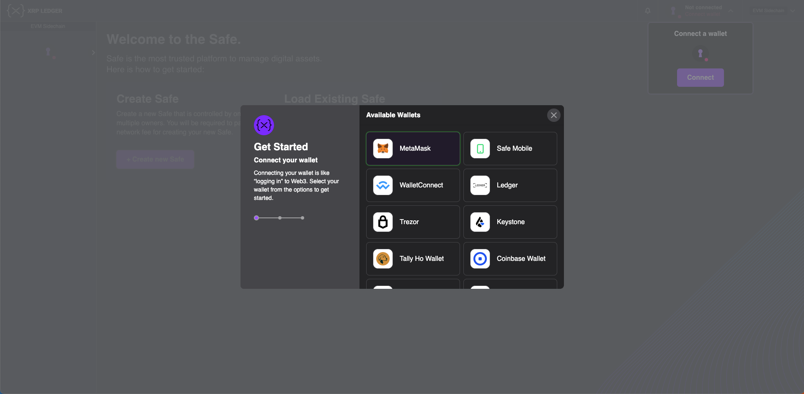
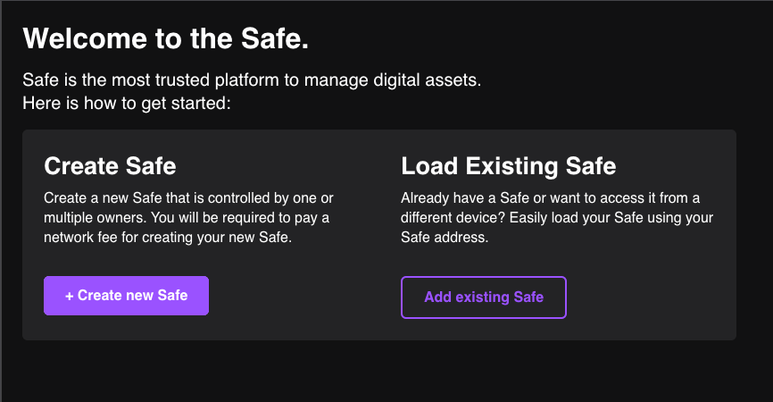
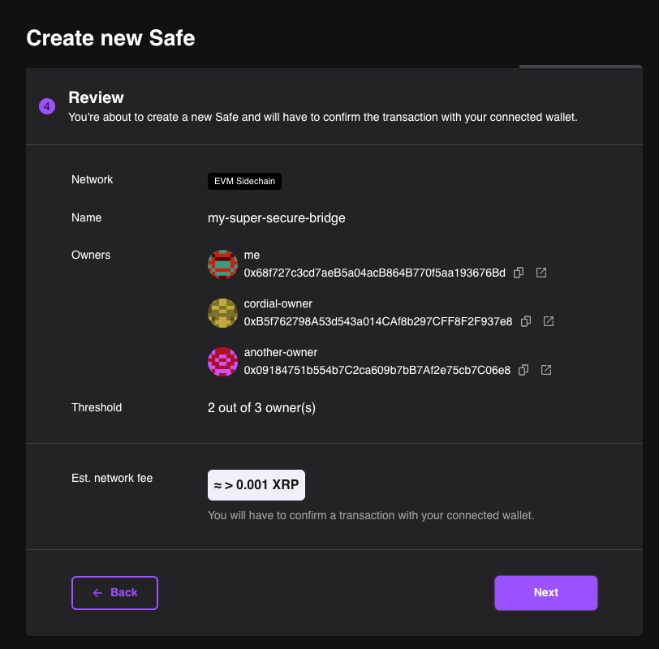
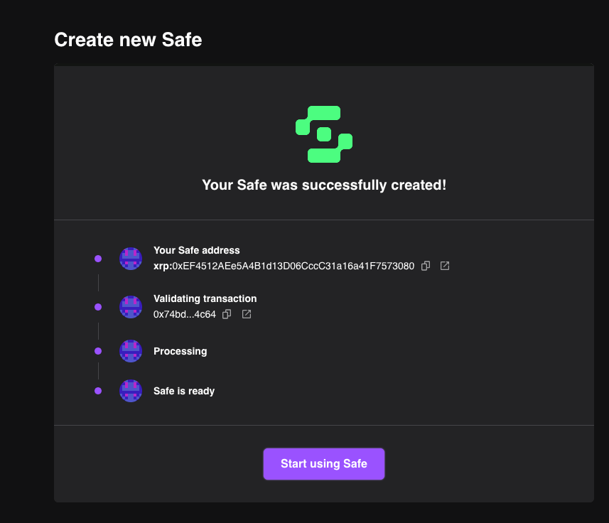
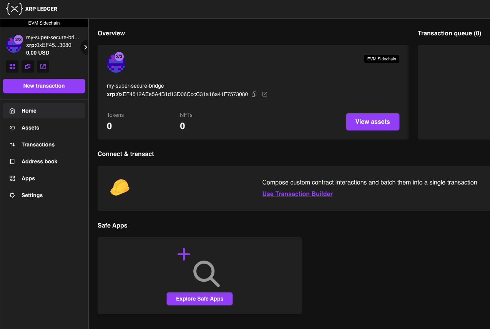
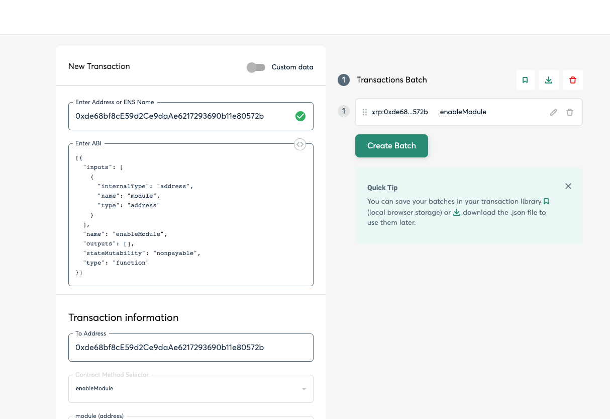
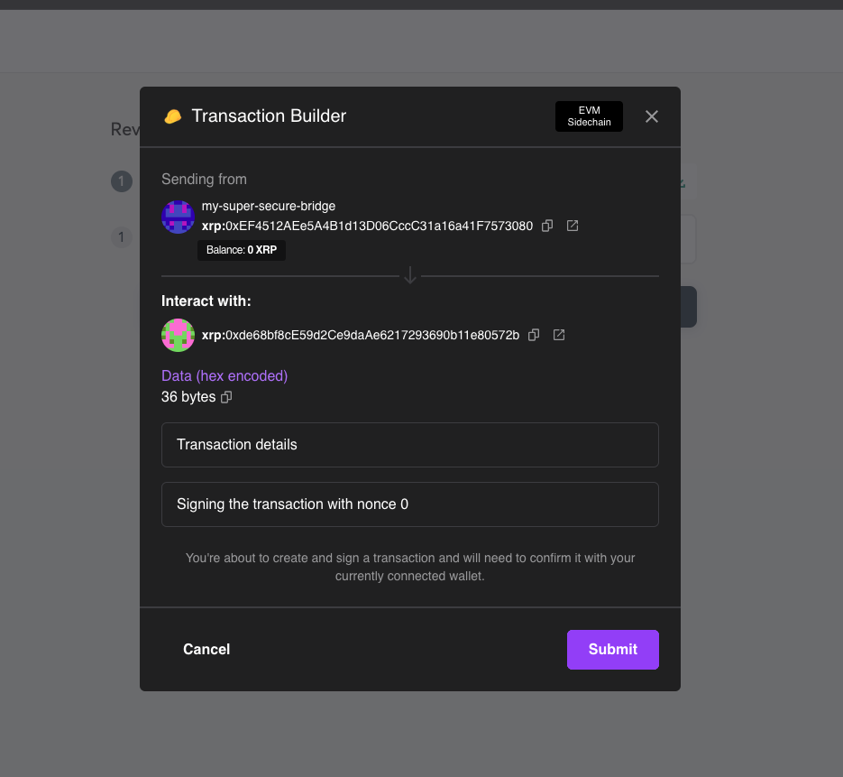
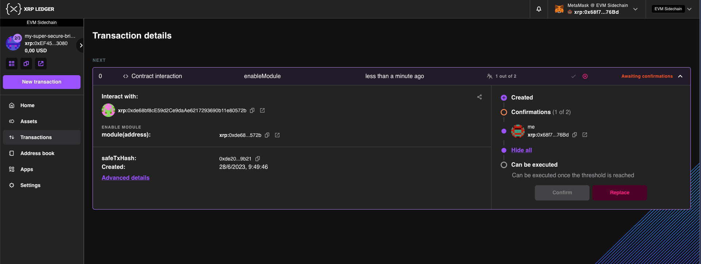
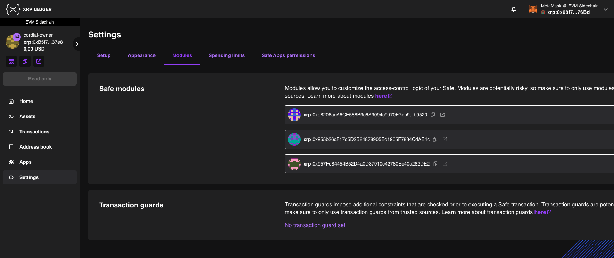

# Deploy a Bridge

<embed src="/snippets/_evm-sidechain-disclaimer.md" />

Before deploying a bridge, familiarize yourself with the parameters and terms used:

- **Currency:** The currency used by the bridge. Depending on the token, the bridge has different setups. If the currency is XRP, the door account is called a _Native Bridge Door_; if the currency is a token, the door account is called a _Token Bridge Door_.
- **Locking Chain:** The chain where the token originally exists. If the locking chain is an XRPL chain, the bridge IOU issuer isn't the bridge door account. If the locking chain is an EVM chain, the ERC20 owner isn't the bridge door account.
- **Issuing Chain:** The chain the token is bridged to. If the issuing chain is an XRPL chain, the bridged IOU issuer is the bridge door account. If the issuing chain is an EVM chain, the bridged ERC20 owner is the bridge door account and can mint/burn tokens.
- **Owners:** The witnesses addresses. For each witness, you must have its address on both chains.
- **Threshold:** The amount of attestations needed for each operation.
- **Signautre Reward:** The reward distributed to witnesses for providing attestations.
- **Minimum Create Account:** For native XRP bridges, this parameter sets the minimum amount of XRP that needs to be locked in order to execute a create account operation.


## Create a Safe Account

Before deploying a bridge, you have to create a Gnosis Safe. The safe is the multisig account that manages all of the bridge's assets.

<iframe width="560" height="315" src="https://www.youtube.com/embed/s9J0516Ta64" title="YouTube video player" frameborder="0" allow="accelerometer; autoplay; clipboard-write; encrypted-media; gyroscope; picture-in-picture; web-share" allowfullscreen></iframe>

1. Connect a wallet to the [Gnosis Safe management platform](https://safe-evm-poa-sidechain.peersyst.tech/).



2. Click **+ Create New Safe**.



- Give the safe a name to identify it locally.
- The owners are the bridge witnesses.
- The threshold is the amount of signatures required to make a transaction on the bridge.

Before submitting, check your information on the review screen.



A prompt will appear, asking to sign the transaction. Carefully review the transaction details before signing it. Once the transaction is submitted, you'll see a success screen.




## Deploy the Bridge Doors

Depending on the bridge currency you want to deploy, there are different steps. Choose the correct bridge type below:


### XRP Native Bridge

XRP bridges are a rare case and should only have one bridge per mainchain and sidechain pair. The sidechain specification forces the XRP issuer account to be `rHb9CJAWyB4rj91VRWn96DkukG4bwdtyTh`.

To deploy an XRP bridge door smart contract, run this typescript command:

```typescript
import { BridgeDoorNative__factory } from "@peersyst/xrp-evm-contracts/dist/typechain/factories/BridgeDoorNative__factory";
import { xrplAccountToEvmAddress } from "./util/address-derivation";
import { ethers } from "ethers";

const safeAddress = "0x...";
const lockingBridgeAddress = "r1..."; // Address of the XRPL bridge
const minRewardAmount = "1";
const minCreateAmount = "50";

const signerWallet = new ethers.Wallet("0..."); // Private key with balance

const bridgeDoorNativeFactory = new BridgeDoorNative__factory(signerWallet);
const bridgeDoorNative = await bridgeDoorNativeFactory.deploy(
    safeAddress,
    ethers.utils.parseEther(minRewardAmount),
    ethers.utils.parseEther(minCreateAmount),
    ethers.constants.AddressZero,
    xrplAccountToEvmAddress(lockingBridgeAddress),
);
const bridgeAddress = bridgeDoorNative.address;
```


### Token Bridge

Token bridges are more common than XRP bridges, so you'll most likely deploy this type.

To deploy a token bridge door smart contract, run this typescript command on the locking chain:

```typescript
import { BridgeDoorNative__factory } from "@peersyst/xrp-evm-contracts/dist/typechain/factories/BridgeDoorNative__factory";
import { xrplAccountToEvmAddress } from "./util/address-derivation";
import { ethers } from "ethers";

const safeAddress = "0x...";
const issuingBridgeAddress = "r1..."; // Address of the XRPL brige
const tokenAddress = "0x..."; // Address of the ERC20 to bridge
const tokenCode = "PER";
const minRewardAmount = "1";
const minCreateAmount = "50";

const signerWallet = new ethers.Wallet("0..."); // Private key with balance

const bridgeDoorTokenFactory = new BridgeDoorToken__factory(signerWallet);
const bridgeDoorToken = await bridgeDoorTokenFactory.deploy(
    safeAddress,
    ethers.utils.parseEther(minRewardAmount),
    ethers.constants.AddressZero,
    tokenAddress,
    xrplAccountToEvmAddress(issuingBridgeAddress),
    xrplAccountToEvmAddress(issuingBridgeAddress),
    tokenCode,
    "",
);

const bridgeAddress = bridgeDoorToken.address;
```

Next, run this typescript command on the issuing chain:

```typescript
import { BridgeDoorNative__factory } from "@peersyst/xrp-evm-contracts/dist/typechain/factories/BridgeDoorNative__factory";
import { xrplAccountToEvmAddress } from "./util/address-derivation";
import { ethers } from "ethers";

const safeAddress = "0x...";
const lockingBridgeAddress = "r1..."; // Address of the XRPL brige
const lockingTokenAddress = "r2..."; // Address of the IOU issuer or address of the ERC20 in the locking chain
const lockingTokenCode = "USD";
const minRewardAmount = "1";
const minCreateAmount = "50";

const signerWallet = new ethers.Wallet("0..."); // Private key with balance

const bridgeDoorTokenFactory = new BridgeDoorToken__factory(signerWallet);
const bridgeDoorToken = await bridgeDoorTokenFactory.deploy(
    safeAddress,
    ethers.utils.parseEther(minRewardAmount),
    xrplAccountToEvmAddress(lockingBridgeAddress),
    xrplAccountToEvmAddress(lockingTokenAddress),
    ethers.constants.AddressZero,
    ethers.constants.AddressZero,
    lockingTokenCode,
    `Bridged ${lockingTokenCode} (${tokenAddress})`,
);

const bridgeAddress = bridgeDoorToken.address;
const tokenAddress = await bridgeDoorToken._tokenAddress();
```


## Authorize the Bridge Door

Enable the safe module to authorize the bridge door to execute transactions. You can do this from the [Gnosis Safe off-chain management platform](https://safe-evm-poa-sidechain.peersyst.tech/).


1. Click **Use Transaction Builder**.

    

2. Enter these fields:
    - **Enter Address or ENS Name:** The address of the safe you created.
    - **Enter ABI:**
        ```
        [{
            "inputs": [
                {
                "internalType": "address",
                "name": "module",
                "type": "address"
                }
            ],
            "name": "enableModule",
            "outputs": [],
            "stateMutability": "nonpayable",
            "type": "function"
        }]
        ```
    - **To Address:** The address of the safe you created.
    - **Contract Method Selector:** _enableModule_
    - **module (address):** The address of the bridge door smart contract you deployed.

3. Click **Add Transaction** to add it to the batch.

    
    

4. Click **Create Batch**.

5. Review the transaction information is correct before clicking **Send Batch**.

6. If the threshold of the safe is one, you can click **Submit**. Otherwise, the other owners of the safe need to review and sign the transaction before you can submit it to the network.

    

    You can check on the status of signatures from the **Transactions** tab.

    

7. Check the module is enabled from **Settings** > **Modules**.

    

    After the module is enabled, witnesses can send attestations and the bridge can begin operating.