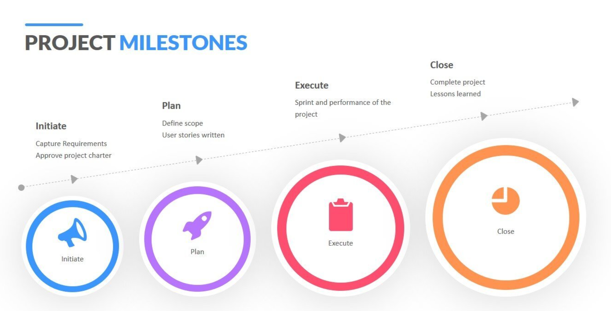

 ---
blurb: Multi-purpose Tokens offer flexibility and functionality that spans use cases between fungible and non-fungible tokens.
labels:
  - Tokens
  - MPT
  - Multi-purpose Tokens
status: not_enabled
---

# Multi-purpose Tokens
|                                                        |                                                           |
|--------------------------------------------------------|-----------------------------------------------------------|
|<a href='https://github.com/XRPLF/XRPL-Standards/tree/master/XLS-0033d-multi-purpose-tokens'>XLS-0033d</a>
Multi-purpose Tokens (MPTs) offer a new level of flexibility and functionality to the XRP Ledger. MPTs span use cases of fungible and non-fungible tokens, facilitating tokenization of real world assets, compliance controls, and developer accessibility.  |  |

|                                |              Resources          |                                                 |
|:------------------------------:|:-------------------------------:|:-----------------------------------------------:|
|   |  |  |
| [XLS-0033d MPT Spec](https://github.com/XRPLF/XRPL-Standards/tree/master/XLS-0033d-multi-purpose-tokens) | [MPT Docs](https://xrpl.org/docs/concepts/tokens/fungible-tokens/multi-purpose-tokens) | [MPT Tutorials](https://xrpl.org/docs/tutorials/javascript/build-apps/get-started) |

|                                                   Use Cases                                                        |
|:------------------------------------------------------------------------------------------------------------------:|

|                        |                             |                               |                             |
|:----------------------:|:---------------------------:|:-----------------------------:|:---------------------------:|
|[  Create an asset-based MPT](https://xrpl-dev-portal--add-mpt-uc-1.preview.redocly.app/docs/use-cases/tokenization/creating-an-asset-backed-multi-purpose-token) |   Transfer an MPT |   Atomic swap of MPTs for other tokens |   Swap MPTs on AMM/DEX |
